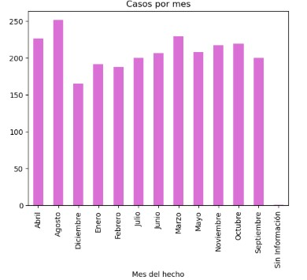
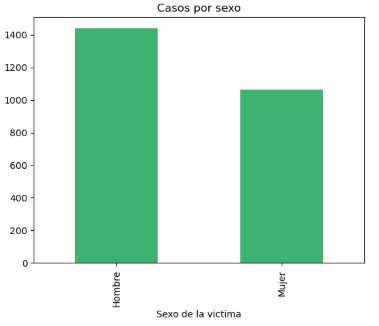
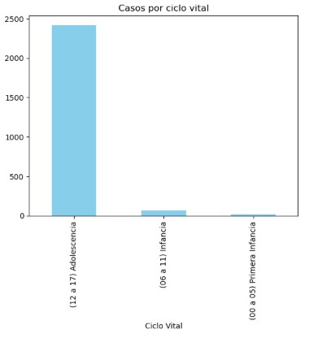
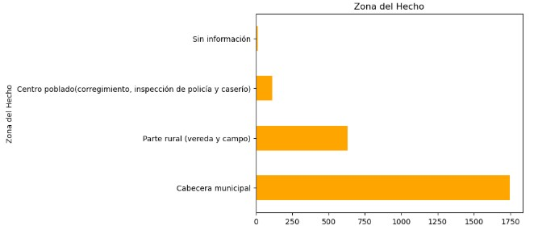
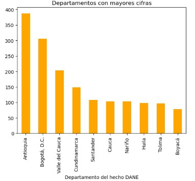
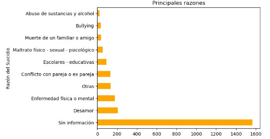

# Análisis y Modelo Predictivo de Riesgo de Suicidio en Población Infantil y Juvenil - Colombia

Este proyecto analiza los presuntos intentos de suicidio reportados por el Instituto Nacional de Medicina Legal y Ciencias Forenses en Colombia (2015–2023), enfocado en población entre 0 y 17 años.

## 🎯 Objetivo

Explorar y comprender los patrones del fenómeno en infancia y adolescencia.  
Además, construir una variable de “Riesgo Alto” con base en criterios psicosociales, y entrenar un modelo predictivo que permita identificar factores relevantes.

## 🔍 Dataset

Fuente: [Datos Abiertos Colombia - Medicina Legal](https://www.datos.gov.co)

Filtrado por:
- Ciclo vital: Primera infancia, Infancia y Adolescencia
- Columnas relevantes como: edad, sexo, escolaridad, razón del suicidio, entre otras

## 📈 Análisis exploratorio

Algunos hallazgos:
- Mayor número de casos en adolescentes (12 a 17 años)
- Predominio en hombres
- Las razones más comunes (cuando disponibles): desamor, enfermedades mentales o físicas
- Mayor frecuencia en Antioquia y Bogotá; predominio en ciudades grandes
- Aumento significativo en 2022, probablemente relacionado al fin del confinamiento

## 🤖 Modelo Predictivo

Se definió una variable binaria `Riesgo Alto` bajo estos criterios:
- Adolescente (12 a 17 años)
- Sexo masculino
- Razón: Desamor, enfermedad física o mental
- Zona: Cabecera municipal
- Año: 2022 o posterior

Modelo usado: `RandomForestClassifier`

Resultados:
- Alta precisión general
- Dificultad para detectar casos de riesgo alto (clase minoritaria)
- Variables más relevantes: Escolaridad, Sexo femenino, Actividad durante el hecho
## 📊 Visualizaciones del Análisis Exploratorio

A continuación se presentan algunas gráficas que permitieron identificar patrones importantes sobre los intentos de suicidio en población infantil y juvenil en Colombia.

### 🗓 Casos por año y por mes

Estas gráficas muestran la evolución de los casos reportados entre 2015 y 2023.

### 👤 Distribución por sexo y ciclo vital

La mayoría de los casos ocurren en adolescentes, con una prevalencia mayor en hombres.

### 🌍 Ubicación geográfica

La mayoría de los casos se presentan en cabeceras municipales y se concentran en departamentos como Antioquia y Bogotá.

### 💔 Razones del suicidio

Aunque muchos registros no incluyen esta información, entre las razones más comunes reportadas se encuentran: desamor, enfermedades mentales y enfermedades físicas.

> ⚠️ Este modelo no busca diagnosticar ni reemplazar juicio clínico. Es un ejercicio exploratorio que muestra cómo el análisis de datos puede apoyar la investigación social.

## 🧠 Reflexión

Como psicóloga interesada en ciencia de datos, este proyecto me permitió conectar estadística, conocimiento contextual y sensibilidad humana. El resultado no es un algoritmo perfecto, sino una herramienta para pensar mejor los datos y comprender cómo la interpretación y manipulación influye en los modelos.

## 🛠️ Herramientas

- Python (pandas, matplotlib, scikit-learn)
- Jupyter Notebook
- GitHub
