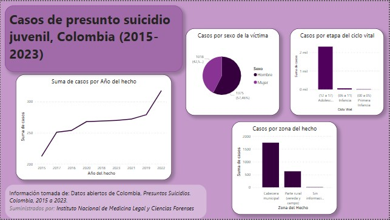

# 📊 Dashboard de suicidio juvenil – Colombia (2015-2023)

Este panel de Power BI explora los datos de suicidio en jóvenes colombianos, basándose en registros de 2015 a 2023. Ofrece visualizaciones interactivas por año, sexo, zona y etapa de la vida.

**🔧 Herramientas:**
- Python (Pandas, Jupyter) para la limpieza y exportación de datos
- Power BI para el diseño de tableros interactivos
- Fuente: Medicina Legal de Colombia (datos públicos)

📷 **Vista previa**

📥 **Descargas**
- [Archivo de Power BI (.pbix)](suicidio_PBI.pbix)
